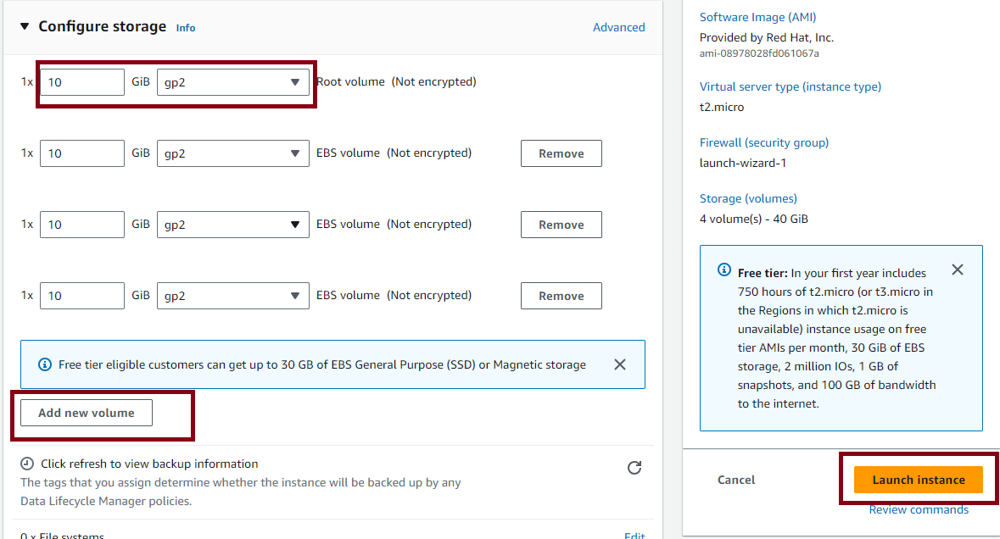
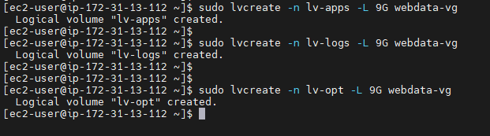

# Devops Tooling Website Solution
## Setup and technologies used in this Project

As a member of a DevOps team, you will implement a tooling website solution which makes access to DevOps tools within the corporate infrastructure easily accessible.

In this project you will implement a solution that consists of following components:

* Infrastructure: AWS

* Webserver Linux: Red Hat Enterprise Linux 8

* Database Server: Ubuntu 20.04 + MySQL

* Storage Server: Red Hat Enterprise Linux 8 + NFS Server

* Programming Language: PHP

* Code Repository: GitHub

**For Rhel 8 server use this ami RHEL-8.6.0_HVM-20220503-x86_64-2-Hourly2-GP2 (ami-035c5dc086849b5de)**


On the diagram below you can see a common pattern where several stateless Web Servers share a common database and also access the same files using Network File Sytem (NFS) as a shared file storage. Even though the NFS server might be located on a completely separate hardware - for Web Servers it look like a local file system from where they can serve the same files.


You need to understand the storage solution suitable for each case.
Step 1 - Prepare NFS Server

    Spin up a new EC2 instance with RHEL Linux 8 Operating System.

You need to understand the storage solution suitable for each case.
## Step 1 - Prepare NFS Server

1. Spin up a new EC2 instance with RHEL Linux 8 Operating System.


2. Based on the LVM experience from Project 9, Configure LVM on the Server.

* Create 3 volumes and attach them to the NFS-Server instance




* Open up the Linux terminal to begin configuration


* Use ```lsblk``` command to inspect what block devices are attached to the server.


* Use ```gdisk``` utility to create a single partition on each of the 3 disks

```
sudo gdisk /dev/xvdd
sudo gdisk /dev/xvdc
sudo gdisk /dev/xvdd

```


* Use ```lsblk``` utility to view the newly configured partition on each of the 3 disks.


* Install ```lvm2``` package using ```sudo yum install lvm2```. Run ```sudo lvmdiskscan``` command to check for available partitions.


* Use pvcreate utility to mark each of 3 disks as physical volumes (PVs) to be used by LVM

```
sudo pvcreate /dev/xvdb1
sudo pvcreate /dev/xvdc1
sudo pvcreate /dev/xvdd1

```


* Verify that your Physical volume has been created successfully by running ```sudo pvs```


* Use vgcreate utility to add all 3 PVs to a volume group (VG). Name the VG ```webdata-vg```

```sudo vgcreate webdata-vg /dev/xvdb1 /dev/xvdc1 /dev/xvdd1```


* Verify that your VG has been created successfully by running ```sudo vgs```


* Instead of formating the disks as ext4 you will have to format them as xfs

3. Create 3 Logical Volumes. lv-opt lv-apps, and lv-logs

```
sudo lvcreate -n lv-apps -L 9G webdata-vg 
sudo lvcreate -n lv-logs -L 9G webdata-vg 
sudo lvcreate -n lv-opt -L 9G webdata-vg
```



* Verify that your Logical Volume has been created successfully by running ```sudo lvs```


* Verify the entire setup

```sudo vgdisplay -v```
```sudo lsblk```


* Use ```mkfs.xfs``` to format the logical volumes with ```xfs filesystem```

```
sudo mkfs -t xfs /dev/webdata-vg/lv-apps
sudo mkfs -t xfs /dev/webdata-vg/lv-logs
sudo mkfs -t xfs /dev/webdata-vg/lv-opt

```


* Create directories to store website files and backup logs

```
sudo mkdir /mnt/apps
sudo mkdir /mnt/logs
sudo mkdir /mnt/opt

```


* Create mount points on ```/mnt directory``` for the logical volumes as follow: Mount ```lv-apps``` on ```/mnt/apps``` - To be used by webservers Mount ```lv-logs``` on /```mnt/logs``` - To be used by webserver logs Mount ```lv-opt``` on ```/mnt/opt``` - To be used by Jenkins server in another Project.

```
sudo mount /dev/webdata-vg/lv-apps /mnt/apps
sudo mount /dev/webdata-vg/lv-logs /mnt/logs
sudo mount /dev/webdata-vg/lv-opt /mnt/opt

```


4. Install NFS server, configure it to start on reboot and make sure it is up and running

```
sudo yum -y update
sudo yum install nfs-utils -y
sudo systemctl start nfs-server.service
sudo systemctl enable nfs-server.service
sudo systemctl status nfs-server.service

```


5. Export the mounts for webservers' subnet cidr to connect as clients. For simplicity, you will install your all three Web Servers inside the same subnet, but in production set up you would probably want to separate each tier inside its own subnet for higher level of security. To check your subnet cidr - open your EC2 details in AWS web console and locate 'Networking' tab and open a Subnet link:


Make sure we set up permission that will allow our Web servers to read, write and execute files on NFS:

```
sudo chown -R nobody: /mnt/apps
sudo chown -R nobody: /mnt/logs
sudo chown -R nobody: /mnt/opt

sudo chmod -R 777 /mnt/apps
sudo chmod -R 777 /mnt/logs
sudo chmod -R 777 /mnt/opt

sudo systemctl restart nfs-server.service

```


Configure access to NFS for clients within the same subnet (example of Subnet CIDR - 172.31.32.0/20 ):

```
sudo vi /etc/exports

/mnt/apps <Subnet-CIDR>(rw,sync,no_all_squash,no_root_squash)
/mnt/logs <Subnet-CIDR>(rw,sync,no_all_squash,no_root_squash)
/mnt/opt <Subnet-CIDR>(rw,sync,no_all_squash,no_root_squash)

Esc + :wq!

sudo exportfs -arv

```


6. 
    Check which port is used by NFS and open it using Security Groups (add new Inbound Rule)

```rpcinfo -p | grep nfs```


Important note: In order for NFS server to be accessible from your client, you must also open following ports: TCP 111, UDP 111, UDP 2049


## Step 2 — Configure the database server

1. Install MySQL Server

```sudo apt install mysql-server -y```


2. Create a database and name it tooling


3. Create a database user and name it web access.


4. Grant permission to webaccess user on tooling database to do anything only from the webservers subnet cidr


## Step 3 — Prepare the Web Servers

We need to make sure that our Web Servers can serve the same content from shared storage solutions, in our case - NFS Server and MySQL database. You already know that one DB can be accessed for reads and writes by multiple clients. For storing shared files that our Web Servers will use - we will utilize NFS and mount previously created Logical Volume lv-apps to the folder where Apache stores files to be served to the users (/var/www).

This approach will make our Web Servers stateless, which means we will be able to add new ones or remove them whenever we need, and the integrity of the data (in the database and on NFS) will be preserved.

During the next steps we will do following:

Configure NFS client (this step must be done on all three servers) Deploy a Tooling application to our Web Servers into a shared NFS folder Configure the Web Servers to work with a single MySQL database.

1. Launch a new EC2 instance with RHEL 8 Operating System


2. Install NFS client.

```sudo yum install nfs-utils nfs4-acl-tools-y```


3. Mount ```/var/www/``` and target the NFS server's export for apps

```
sudo mkdir /var/www
sudo mount -t nfs -o rw,nosuid <NFS-Server-Private-IP-Address>:/mnt/apps /var/www

```


4. Verify that NFS was mounted successfully by running ```df -h```. Make sure that the changes will persist on Web Server after reboot:

```sudo vi /etc/fstab```

add the following lines

```<NFS-Server-Private-IP-Address>:/mnt/apps /var/www nfs defaults 0 0```


5. Install Remi's repostitory, Apache and PHP

```
sudo yum install httpd -y

sudo dnf install https://dl.fedoraproject.org/pub/epel/epel-release-latest-8.noarch.rpm

sudo dnf install dnf-utils http://rpms.remirepo.net/enterprise/remi-release-8.rpm

sudo yum module  list php -y

sudo dnf module reset php

sudo dnf module enable php:remi-7.4

sudo dnf install php php-opcache php-gd php-curl php-mysqlnd

sudo systemctl start php-fpm

sudo systemctl enable php-fpm

sudo setsebool -P httpd_execmem 1

```

Repeat steps 1-5 for another 2 Web Servers


6. Verify that Apache files and directories are available on the Web Server in ```/var/www``` and also on the NFS server in ```/mnt/apps```. If you see the same files - it means NFS is mounted correctly. You can try to create a new file ```touch test.txt``` from one server and check if the same file is accessible from other Web Servers.

NFS-Server Directory  

Webserver 1 directory 

Webserver 2 directory 

Webserver 3 directory 

Webserver 1 test      

Webserver 2 test confirmation 

Webserver 3 test confirmation 

NFS-Server test confirmation 

7. Locate the log folder for Apache on the Web Server and mount it to NFS server's export for logs. Repeat step №4 to make sure the mount point will persist after reboot.

```sudo mount -t nfs -o rw,nosuid <NFS-Server-Private-IP-Address>:/mnt/logs /var/log/httpd```


```sudo vi /etc/fstab```


```<NFS-Server-Private-IP-Address>:/mnt/logs /var/log/httpd nfs defaults 0 0```


8. Fork the tooling source code [click here](https://github.com/Psalmjoe) to your Github account. (Learn how to fork a repo [here](https://www.youtube.com/watch?v=f5grYMXbAV0))


9. Deploy the tooling website's code to the Webserver. Ensure that the ```html``` folder from the repository is deployed to ```/var/www/html```


**Note 1**: Do not forget to open TCP port 80 on the Web Server.


**Note 2**: If you encounter 403 Error - check permissions to your ```/var/www/html``` folder and also disable SELinux ```sudo setenforce 0``` To make this change permanent - open following config file ```sudo vi /etc/sysconfig/selinux``` and set SELINUX=disabled, then restrt httpd.


Update the binding address of the database server

```Update the binding address of the database server```


10. Edit the webserver and update the website's configuration to connect to the database (in ```sudo vi /var/www/html/functions.php``` file). 


* Install mysql client on the webservers using sudo yum install mysql -y. 


* Apply tooling-db.sql script to your database. Run the below command on your webserver then run queries on your DB-Server to confirm that the connection has been established:

```mysql -h <databse-private-ip> -u <db-username> -p <db-pasword> < tooling-db.sql```


**Note: On the webserver, cd into the tooling directory before running the above command and also ensure that port 3306 of the DB server is open**

11. Create in MySQL a new admin user with username: myuser and password: password:

```
INSERT INTO 'users' ('id', 'username', 'password', 'email', 'user_type', 'status') VALUES
-> (1, 'myuser', '5f4dcc3b5aa765d61d8327deb882cf99', 'user@mail.com', 'admin', '1');
```

12. Open the website in your browser ```http://<Web-Server-Public-IP-Address-or-Public-DNS-Name>/index.php``` and make sure you can login into the website with myuser user.

Webserver 1


Webserver 2


Webserver 3


