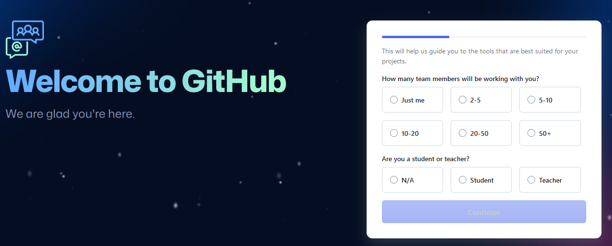
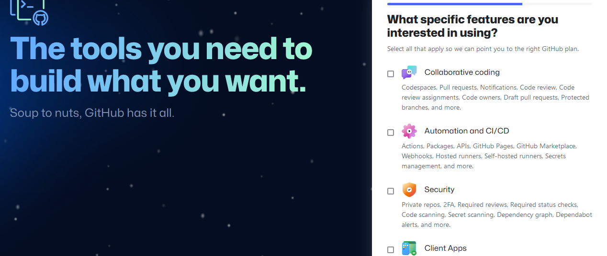

# Git Project

The basic Git projects are collections of beginner-friendly tasks designed to introduce participants to the fundamentals of Git, a powerful version control system widely used in software development. This practical mini-projects, and hands-on exercises will help learners quickly grasp the core concepts and confidently utilize Git in their projects.

## Initializing a Repository and Making Commits

### Initializing a Git Repository

To create a new repo, you'll use the git init command. git init is a one-time command you use during the initial setup of a new repo. Executing this command will create a new .git subdirectory in your current working directory. This will also create a new main branch.

#### Steps to Initialize a Git Repo: 

1. Open a terminal on your computer e.g git bash or vs code.
2. On the terminal create a working folder or directory e.g ```DevOps```
3. Change into the working directory using ```cd DevOps```
4. While inside the folder, run ```git init``` command.


### Make The First Commit

Commit is more or less saving the changes made to a file. Changes can be adding, modifying or deleting a file or text. When you make a commit, git takes a snapshot of your current repository and saves a copy in the .git folder inside your working directory.

#### Steps to Make a First Commit:

1. Inside your working directory create a file index.txt using this command ```touch index.txt```
2. Write any sentence of your choice inside the text file. Afterwards save the changes.
3. Add your changes to the git staging area using this command ```git add .```
4. To commit your changes to git, run the command ```git commit -m "first commit"``` (The -m flag is used to provide a commit message).


## Working With Branches

### How Branches Work

A key feature of Git is branching. Think of the trunk of a tree as your main project. We create branches to separate our work for each task. It helps us isolate and work on one part of the project without directly impacting the main project until we are ready to merge it back in.
Git branch helps you create a different copy of your source code. In your new branch, you can make changes as you please. Your change is independent of what is available in the main copy.

Git branch is also an important tool for collaboration with remote teams. They can make separate branches while working on the same feature and then converge their code to one branch when they are all done.

### Make Your First Git Branch

Syntax

```git checkout -b```

To make a new branch called riverdale, run the command:

```git checkoot -b riverdale```


### Listing Your Git Branches

To list the branches on your local git repositories, run

```git branch```


### Change into an Old Branch

To change into an old branch, use the command below

```git checkout master```


### Merging a Branch into Another Branch

If we have 2 branches A and B and want to merge the contents of branch B into branch A, we first change into branch A and run the command below :

```git merge B```


### Deleting a Git Branch

A feature branch enables the addition of a new feature to an application. After the code has been tested and merged into a staging of dev environment depending on the branch strategy of the team, the branch can be deleted using the below syntax:

```git branch -d <branch_name>```


## Collaboration and Remote Repositories

In addition to all the functions above, git can also be used for collaboration amongst remote workers by using a remote repository such as github, a web-based platform where git repositories are hosted. Thus remote teams can now view, update, and modify the same repository.

### Creating a Github Account

To create a Github account, follow the below steps:

1. Go to Github website

    [*Join Github*](https://www.github.com)

2. Enter your username, password and email.


3. Click on the verify button to solve a puzzle


4. Click on create account


5.  Enter the activation code sent to your mail


6. Select your preferences and continue



7. Select features you are interested in and click on continue




### Creating your First Repository

To create your first repository, follow the steps below:

1. In the upper-right corner of any page, use the drop-down menu, and select New repository.


2. Type a short, unique name for your repository, add a desciption (optional), and select whether it is a public or private repository.


3. Click on the green button to create a repository.

### Pushing Your Local Git Repository to Your Remote Github Repository

To add a remote repository to a local repository, use the command:

```git remote add origin <link to your github repo>```


To get the remote link, click on the green button and copy the https link as shown below:


After commotting changes in the local repo, push to the remote repository using the command below:

```git push origin <branch name>```


### Clone Remote Git Repository

The git clone command helps us to make a copy of our remote repository on our local machine. Thge syntax is shown below:

```git clone <link to your remote repository>```


## Branch Management and Tagging

### Introduction to Markdown Syntax

Markdown is a lightweight markup language for creating formatted text using a plain-text editor. John Gruber created Markdown in 2004 as a markup language that is easy to read in its source code form. Markdown is widely used for blogging and instant messaging, and also used elsewhere in online forums, collaborative software, documentation pages, and readme files.

Some commonly markdown syntax are as below :

* Headings: The number of hash symbols used indicates the level of the heading.

```
    # Heading 1
    ## Heading 2
    ### Heading 3
    #### Heading 4
```
* Emphasis: Asterisks or underscore is used for emphasis.

    ```*italics* or _italics_``` ```**bold** or __bold__```


* Ordered list
    
    i. First item

    ii. Second item

    iii. Third item


* Unordered list

    ```- Item 1```

    ```- Item 2```

    ```- Item 3```

* Links : To create links, use the square brackets for the link text followed by parenthesis containing the url.

[Visit darey.io](https://www.darey.io)

* Images : To display an image, use an exclamation mark followed by square brackets for the alt text and parenthesis for the image url.


* Code : To display code, use backticks (`) to enclose the code.
