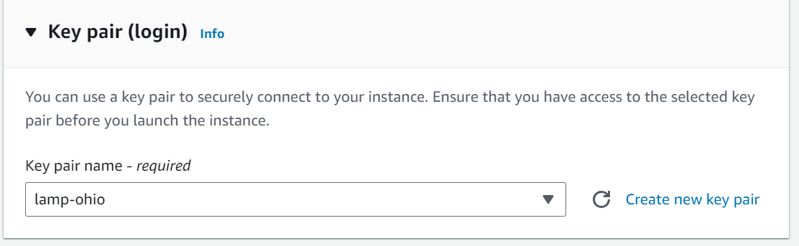
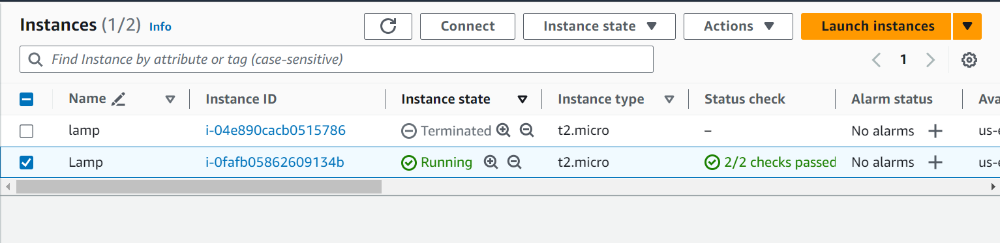
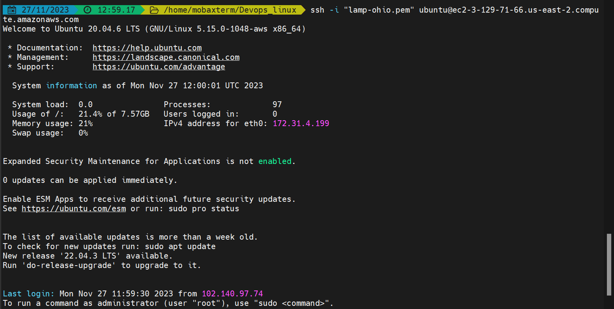
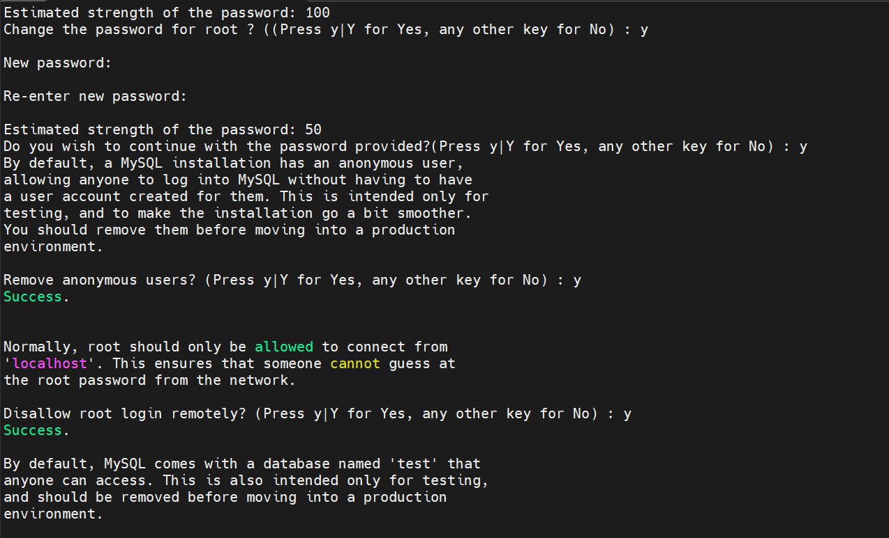
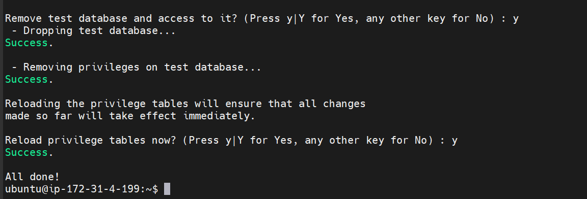

# LAMP STACK IMPLIMENTATION

A technology stack is a set of frameworks and tools used to develop a software product. It is essentially a set of technologies that are stacked together to build any application. Popularly known as a technology infrastructure or solutions stack, technology stack has become essential for building easy-to-maintain, scalable web applications.

Technology stack determines the type of applications you can build, the level of customizations you can perform, and the resources you need to develop your application. A technology stack consists of two primary components: a frontend stack and a backend stack. Some popular examples of tech stack include:

* The LAMP stack: Linux, Apache, MYDQL and PHP,
* LEMP stack: Nginx, MYSQL and PHP
* MEAN stack: MongoDB, Express.js AngularJS and Node.js.
* MERN stack: MongoDB, Express.js, React, and Node.js.

## Preparing Prerequisite

To complete this tutorial, you will need an AWS account and a virtual server with Ubuntu OS.

Click on the below links to watch a video on how to :

1. [_Setup your account and provision an ubuntu server with EC2_](https://www.youtube.com/watch?v=xxKuB9kJoYM&list=PLtPuNR8I4TvkwU7Zu0l0G_uwtSUXLckvh&index=7)

2. [_Connect to your EC2 instance_](https://www.youtube.com/watch?v=TxT6PNJts-s&list=PLtPuNR8I4TvkwU7Zu0l0G_uwtSUXLckvh&index=8)

Alternatively, you can follow the step by step guide below :

1. Register a new AWS account: [Create a new AWS Account](https://portal.aws.amazon.com/billing/signup?nc2=h_ct&src=header_signup&redirect_url=https%3A%2F%2Faws.amazon.com%2Fregistration-confirmation#/start/email)

2. Select your prefered region, name your EC2 instance, Create a new key pair, and then launch your EC2 instance (choose t2.micro and ubuntu server 20.04 LTS)




3. There are different ways to connect to your EC2 instance but in this tutorial, we will use Git bash. Therefore, launch git and change to the directory where the key pair is downloaded (usually the downloads folder or any folder you choose to copy the key pair to. In my case, I have my key pair copied into a folder called <font colour="red"> Devops_linux </font> ) using the below command :

> cd Devops_linux


4. Connect to the instance by running:

> ssh -i private-key-name.pem ubuntu@Public-IP-address

This can also be found under "SSH client" when you click on "connect" in the launched EC2 instance.




5. Copy the code to git and press "enter" to successfully connect to the ubuntu instance.




## Installing Apache and Updating the Firewall


## Step 1 -  Installing Apache and Updating the Firewall

Apache is a popular open-source, cross-platform web server that is, by the numbers, the most popular web server in existence. It’s actively maintained by the Apache Software Foundation.

Some high-profile companies using Apache include Cisco, IBM, Salesforce, General Electric, Adobe, VMware, Xerox, LinkedIn, Facebook, Hewlett-Packard, AT&T, Siemens, eBay, and many more.

In addition to its popularity, it’s also one of the oldest web servers, with its first release all the way back in 1995.

Install Apache using Ubuntu's package manager '_apt_'

#update a list of packages in package manager

>sudo apt update


#run apache2 package installation

>sudo apt install apache2


To verify that Apache2 is running as as service in our OS, run the following command :

>sudo systemctl status apache2


If it is green and running, then you did everything correctly and you have just lunched your first web server in the cloud.

In order for our webserver to receive any traffic, we need to open the http port 80 which is the default port that web browsers use to access web pages on the internet. Up until now only the SSH port 22 is open by default during our instance launch.

Port 80 can be opened by modifying the security group of the running EC2 instance.


Our server is now running and we can access it locally and from the internet.

To access it locally in our Ubuntu shell, run 

```curl http://localhowst:80```

or 

```curl http://3.129.71.66:80```

The 2 commands above are the same. The difference is that the first one uses the DNS name while the second uses the local IP which corresponds to the DNS name, localhost.

Next, we can test if our Apache HTTP server can respond to requests from the internet. Open any browser and try to access the url below :

```http://<Public-IP-Address>:80```

Another way to retrieve your public Ip address other than to check it in AWS console is to run the below command :

>curl -s http://3.129.71.66/latest/meta-data/public-ipv4

Since all browsers use port 80 by default, it is not neccessary to specify the port number.

If you can see the below page, it means that you have correctly installed your Apache web server and accessible through your firewall.


The above is the same result we got using the curl command but now represented in nice HTML format by the web browser.

## Installing MySQL

## Step 2 - Installing MySQL

Now that our webserver is up and running, we need to install a Database Management System (DBMS) to be able to store and manage data for our site. For this purpose, we will use Mysql, a relational database managemet system used within PHP environments.

To install Mysql-server, run the code below :

> sudo apt install mysql-server

When prompted, confirm the installation by typing y and the press enter.


When installation is completed, log in to mysql console using the command :

> sudo mysql

This will connect to the administrative database user root and you will see an output as below :


it’s recommended that you run a security script that comes pre-installed with MySQL. This script will remove some insecure default settings and lock down access to your database system.

Then run the following ALTER USER command to change the root user’s authentication method to one that uses a password. The following example changes the authentication method to mysql_native_password:

> ALTER USER 'root'@'localhost' IDENTIFIED WITH mysql_native_password BY 'PassWord.1';


After making this change, exit the MySQL prompt:

> mysql> exit


Following that, you can run the mysql_secure_installation script without issue.

Start the interactive script by running:

>sudo mysql_secure_installation

This will ask if you want to configure the VALIDATE PASSWORD PLUGIN.

Note: Enabling this feature is something of a judgment call. If enabled, passwords which don’t match the specified criteria will be rejected by MySQL with an error. It is safe to leave validation disabled, but you should always use strong, unique passwords for database credentials.

Answer Y for yes, or anything else to continue without enabling.

VALIDATE PASSWORD PLUGIN can be used to test passwords and improve security. It checks the strength of password and allows the users to set only those passwords which are secure enough. Would you like to setup VALIDATE PASSWORD plugin?

Press y|Y for Yes, any other key for No:

If you answer “yes”, you’ll be asked to select a level of password validation. Keep in mind that if you enter 2 for the strongest level, you will receive errors when attempting to set any password which does not contain numbers, upper and lowercase letters, and special characters:


Regardless of whether you chose to set up the VALIDATE PASSWORD PLUGIN, your server will next ask you to select and confirm a password for the MySQL root user. This is not to be confused with the system root. The database root user is an administrative user with full privileges over the database system. Even though the default authentication method for the MySQL root user doesn’t involve using a password, even when one is set, you should define a strong password here as an additional safety measure.

If you enabled password validation, you’ll be shown the password strength for the root password you just entered and your server will ask if you want to continue with that password. If you are happy with your current password, enter Y for “yes” at the prompt:



For the rest of the questions, press Y and hit the ENTER key at each prompt. This will remove some anonymous users and the test database, disable remote root logins, and load these new rules so that MySQL immediately respects the changes you have made.



When you’re finished, test whether you’re able to log in to the MySQL console by typing:

>sudo mysql -p


For increased security, it’s best to have dedicated user accounts with less expansive privileges set up for every database, especially if you plan on having multiple databases hosted on your server.

Your MySQL server is now installed and secured. Next, you’ll install PHP, the final component in the LAMP stack.

## Installing PHP

## Step 3 - Installing PHP

You have Apache installed to serve your content and MySQL installed to store and manage your data. PHP is the component of our setup that will process code to display dynamic content to the final user. In addition to the php package, you’ll need php-mysql, a PHP module that allows PHP to communicate with MySQL-based databases. You’ll also need libapache2-mod-php to enable Apache to handle PHP files. Core PHP packages will automatically be installed as dependencies.

To install these 3 packages at once, run the following command:

> sudo apt install php libapache2-mod-php php-mysql


Once the installation is finished, run the following command to confirm your PHP version:

>php -v


At this point, your LAMP stack is fully operational.

* Linux (Ubuntu)
* Apache HTTP server
* MySQL
* PHP

Before testing your setup with a PHP script, it’s best to set up a proper Apache Virtual Host to hold your website’s files and folders. Virtual host allows you to have multiple websites located on a single machine and users of the website will not even notice it.

## Creating a Virtual Host for your Website using Apache

### Step 4 - Creating a Virtual Host for your Website Apache

When using the Apache web server, you can create virtual hosts (similar to server blocks in Nginx) to encapsulate configuration details and host more than one domain from a single server. In this guide, we’ll set up a domain called projectlamp, but you can replace this with your own domain name.

Apache on Ubuntu 22.04 has one virtual host enabled by default that is configured to serve documents from the /var/www/html directory. While this works well for a single site, it can become unwieldy if you are hosting multiple sites. Instead of modifying /var/www/html, we’ll create a directory structure within /var/www for the your_domain site, leaving /var/www/html in place as the default directory to be served if a client request doesn’t match any other sites.

Create the directory for your_domain as follows:

>sudo mkdir /var/www/projectlamp