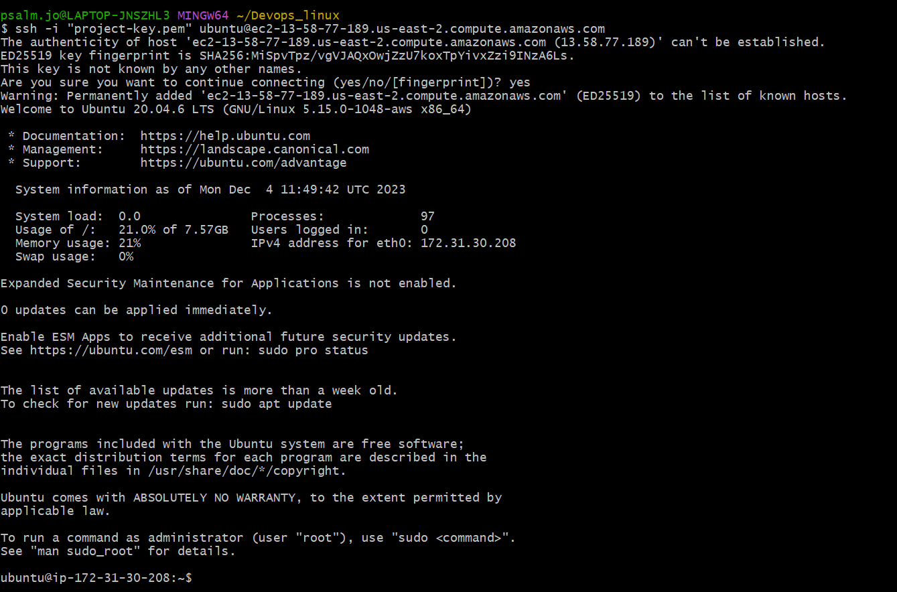
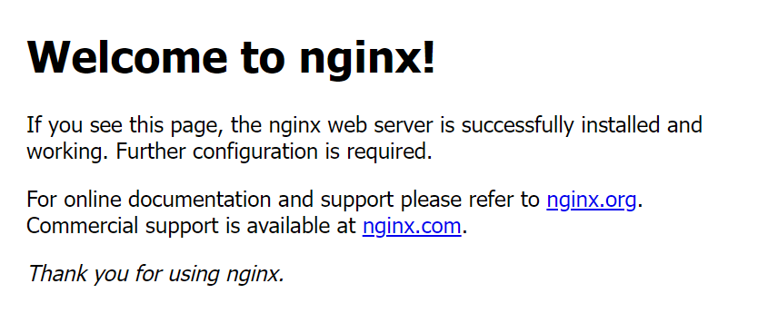
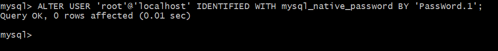
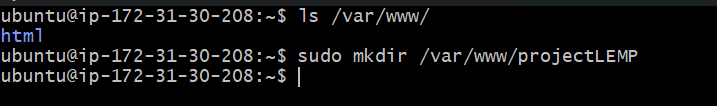
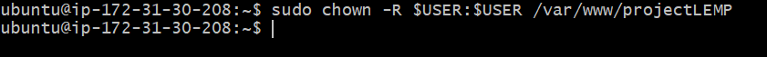
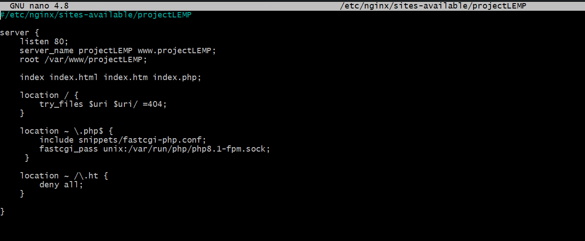

# LEMP STACK IMPLEMENTATION

## Introduction


LEMP refers to a collection of open-source software that is commonly used together to serve web applications. The term LEMP is an acronym that represents the configuration of a Linux operating system with an nginx (pronounced engine-x, hence the E in the acronym) web server, with site data stored in a MySQL database and dynamic content processed by PHP.

This guide demonstrates how to install a LEMP stack on an Ubuntu 20.04 server. The Ubuntu operating system takes care of the first requirement. We will describe how to get the rest of the components up and running.

## Prerequisites

In order to complete this project, you will need an AWS account and a virtual server with an Ubuntu server OS.

If you do not have an AWS account, to back to project 3 (LAMP STACK IMPLEMENTATION) to sign in to an AWS free tier account and create an EC2 account with Ubuntu server 22.04 LTS (HVM) image.

After downloading and installing Git Bash, lauch it and run the below command :

```ssh -i <Your-private-key.pem>ubuntu@<EC2-Public-IP-address>```



## Installing the Nginx Webserver

### Step 1 - Installing the Nginx Webserver

In order to display web pages to our site visitors, we are going to employ Nginx, a high-performance web server. We’ll use the apt package manager to obtain this software.

Since this is our first time using apt for this session, start off by updating your server’s package index. Following that, you can use apt install to get Nginx installed:

```sudo apt update```

```sudo apt install nginx```

When prompted, enter Y to confirm that you want to install Nginx. Once the installation is finished, the Nginx web server will be active and running on your Ubuntu 20.04 server.

To verify that Nginx was successfully installed and is running as a service in Ubuntu, run :

```sudo systemctl status nginx```


If it is green and running as above then you did everything correctly and have just lauched your webserver in he cloud.

Before we can receive any traffic by our webserver, we need to open *TCP port 80* which is the default port that web browsers use to access web pages on the internet. Up until now only the SSH port 22 is open by default during our instance launch.

Port 80 can be opened by modifying the security group of the running EC2 instance.


Our server is now running and we can access it both locally and on the internet from any Ip.

First, let us try to access it locally in our Ubuntu shell. Run :

```curl http://localhost:80```

or

```curl http://127.0.0.1:80```


The 2 commands above are the same. The difference is that the first one uses the DNS name while the second uses the local IP which corresponds to the DNS name, localhost.

Next, we can test if our Nginx HTTP server can respond to requests from the internet. Open any browser and try to access the url below :

```http://<Public-IP-Address>:80```

Another way to retrieve your public Ip address other than to check it in AWS console is to run the below command :

```curl -s http://169.254.169.254/latest/meta-data/public-ipv4```

Since all browsers use port 80 by default, it is not neccessary to specify the port number.

If you can see the below page, it means that you have correctly installed your Apache web server and accessible through your firewall.



The above is the same result we got using the curl command but now represented in nice HTML format by the web browser.

## Installing Mysql
### Step 2 - Installing Mysql

Now that our webserver is up and running, we need to install a **Database Management System (DBMS)** to be able to store and manage data for our site. For this purpose, we will use Mysql, a relational database managemet system used within PHP environments.

To install Mysql-server, run the code below :

```sudo apt install mysql-server```

When prompted, confirm the installation by typing ```Y``` and the press ```ENTER```.


When installation is completed, log in to mysql console using the command :

```sudo mysql```

This will connect to the administrative database user **root** and you will see an output as below :


It is recommended that you run a security script that comes pre-installed with MySQL. This script will remove some insecure default settings and lock down access to your database system.

Before running the script, you will set a password for the **root** user using mysql_native_password as default authentication method. We are defining this user's password as ```PassWord.1```

```ALTER USER 'root'@'localhost' IDENTIFIED WITH mysql_native_password BY 'PassWord.1';```



After making this change, exit the MySQL prompt:

```mysql> exit```


Following that, you can run the mysql_secure_installation script without issue.

Start the interactive script by running:

```sudo mysql_secure_installation```

This will ask if you want to configure the ```VALIDATE PASSWORD PLUGIN```.

Note: Enabling this feature is something of a judgment call. If enabled, passwords which don’t match the specified criteria will be rejected by MySQL with an error. It is safe to leave validation disabled, but you should always use strong, unique passwords for database credentials.

Answer ```Y``` for yes, or anything else to continue without enabling.

```
VALIDATE PASSWORD PLUGIN can be used to test passwords and improve security. It checks the strength of password and allows the users to set only those passwords which are secure enough. Would you like to setup VALIDATE PASSWORD plugin?
```

```Press y|Y for Yes, any other key for No:```

If you answer “yes”, you’ll be asked to select a level of password validation. Keep in mind that if you enter ```2``` for the strongest level, you will receive errors when attempting to set any password which does not contain numbers, upper and lowercase letters, and special characters:


Regardless of whether you chose to set up the ```VALIDATE PASSWORD PLUGIN```, your server will next ask you to select and confirm a password for the MySQL **root** user. This is not to be confused with the **system root**. The **database root** user is an administrative user with full privileges over the database system. Even though the default authentication method for the MySQL root user doesn’t involve using a password, **even when one is set**, you should define a strong password here as an additional safety measure.

If you enabled password validation, you’ll be shown the password strength for the root password you just entered and your server will ask if you want to continue with that password. If you are happy with your current password, enter ```Y``` for “yes” at the prompt:


For the rest of the questions, press ```Y``` and hit the ```ENTER``` key at each prompt. This will remove some anonymous users and the test database, disable remote root logins, and load these new rules so that MySQL immediately respects the changes you have made.


When you’re finished, test whether you’re able to log in to the MySQL console by typing:

```sudo mysql -p```

Notice the ```-p``` flag in this command which will prompt you for the command used after chaning the root user password.

To exit the Mysql console, type :

```mysql> exit```


For increased security, it’s best to have dedicated user accounts with less expansive privileges set up for every database, especially if you plan on having multiple databases hosted on your server.

>Note: At the time of this writing, the native MySQL PHP library mysqlnd doesn’t support caching_sha2_authentication, the default authentication method for MySQL 8. For that reason, when creating database users for PHP applications on MySQL 8, you’ll need to make sure they’re configured to use mysql_native_password instead. We’ll demonstrate how to do that in Step 6.

Your MySQL server is now installed and secured. Next, you’ll install PHP, the final component in the LEMP stack.

## Installing PHP
### Step 3 - Installing PHP

You have Nginx installed to serve your content and MySQL installed to store and manage your data. Now you can install **PHP** to process code and generate dynamic content for the web server.

While Apache embeds the PHP interpreter in each request, Nginx requires an external program to handle PHP processing and act as a bridge between the PHP interpreter itself and the web server. This allows for a better overall performance in most PHP-based websites, but it requires additional configuration. You’ll need to install ```php-fpm```, which stands for “PHP fastCGI process manager”, and tell Nginx to pass PHP requests to this software for processing. Additionally, you’ll need ```php-mysql```, a PHP module that allows PHP to communicate with MySQL-based databases. Core PHP packages will automatically be installed as dependencies.

To install the php-fpm and php-mysql packages, run :

```sudo apt install php-fpm php-mysql```

When prompted, type ```Y``` and ```ENTER``` to confirm installation.


You now have your PHP components installed. Next, you’ll configure Nginx to use them.

## Configuring Nginx to Use the PHP Processor

### Step 4 — Configuring Nginx to Use the PHP Processor

When using the Nginx web server, we can create server blocks (similar to virtual hosts in Apache) to encapsulate configuration details and host more than one domain on a single server. In this guide, we’ll use **projectLEMP** as an example domain name.

On Ubuntu 20.04, Nginx has one server block enabled by default and is configured to serve documents out of a directory at ```/var/www/html```. While this works well for a single site, it can become difficult to manage if you are hosting multiple sites. Instead of modifying ```/var/www/html```, we’ll create a directory structure within ```/var/www``` for the your_domain website, leaving ```/var/www/html``` in place as the default directory to be served if a client request doesn’t match any other sites.

Create the root web directory for ```projectLEMP``` as follows:

```sudo mkdir /var/www/projectLEMP```



Next, assign ownership of the directory with the $USER environment variable, which will reference your current system user:

```sudo chown -R $USER:$USER /var/www/projectLEMP```



Then, open a new configuration file in Nginx’s ```sites-available``` directory using your preferred command-line editor. Here, we’ll use ```nano``` :

```sudo nano /etc/nginx/sites-available/projectLEMP```

This will create a new blank file. Paste in the following bare-bones configuration :

```#/etc/nginx/sites-available/projectLEMP

server {
    listen 80;
    server_name projectLEMP www.projectLEMP;
    root /var/www/projectLEMP;

    index index.html index.htm index.php;

    location / {
        try_files $uri $uri/ =404;
    }

    location ~ \.php$ {
        include snippets/fastcgi-php.conf;
        fastcgi_pass unix:/var/run/php/php8.1-fpm.sock;
     }

    location ~ /\.ht {
        deny all;
    }

}
```

Here’s what each of these directives and location blocks do:

* ```listen``` — Defines what port Nginx will listen on. In this case, it will listen on port ```80```, the default port for HTTP.

* ```root``` — Defines the document root where the files served by this website are stored.

* ```index``` — Defines in which order Nginx will prioritize index files for this website. It is a common practice to list ```index.html``` files with a higher precedence than ```index.php``` files to allow for quickly setting up a maintenance landing page in PHP applications. You can adjust these settings to better suit your application needs.

* ```server_name``` — Defines which domain names and/or IP addresses this server block should respond for. **Point this directive to your server’s domain name or public IP address.**

* ```location /``` — The first location block includes a ```try_files``` directive, which checks for the existence of files or directories matching a URI request. If Nginx cannot find the appropriate resource, it will return a 404 error.

* ```location ~ \.php$``` — This location block handles the actual PHP processing by pointing Nginx to the fastcgi-php.conf configuration file and the ```php7.4-fpm.sock file```, which declares what socket is associated with ```php-fpm```.

* ```location ~ /\.ht``` — The last location block deals with ```.htaccess``` files, which Nginx does not process. By adding the deny all directive, if any ```.htaccess``` files happen to find their way into the document root ,they will not be served to visitors.

When you’re done editing, save and close the file. If you’re using ```nano```, you can do so by typing ```CTRL+X``` and then ```y``` and ```ENTER``` to confirm.



Activate your configuration by linking to the config file from Nginx’s sites-enabled directory:

```sudo ln -s /etc/nginx/sites-available/projectLEMP /etc/nginx/sites-enabled/```


This will tell Nginx to use the configuration next time it is reloaded. You can test your configuration for syntax errors by typing:

```sudo nginx -t```

You will see the below message :


If any errors are reported, go back to your configuration file to review its contents before continuing.

We also need to disable default Nginx host that is currently configured to listen on port 80. To do this, run :

```sudo unlink /etc/nginx/sites-enabled/default```


When you are ready, reload Nginx to apply the changes :

```sudo systemctl reload nginx```

Your new website is now active, but the web root /var/www/projectLEMP is still empty. Create an index.html file in that location so that we can test that your new server block works as expected :

```sudo echo 'Hello LEMP from hostname' $(curl -s http://169.254.169.254/latest/meta-data/public-hostname) 'with public IP' $(curl -s http://169.254.169.254/latest/meta-data/public-ipv4) > /var/www/projectLEMP/index.html```

Alternatively, you can use nano to edit the file :

```nano /var/www/projectLEMP/index.html```

Include the following content in this file :

```/var/www/projectLEMP/index.html```

```<html>
  <head>
    <title>projectLEMP website</title>
  </head>
  <body>
    <h1>Hello World!</h1>

    <p>This is the landing page of <strong>Project LEMP</strong>.</p>
  </body>
</html>
```

Now go to your browser and and try to open yur website url using your IP address as below :

```http://<Public-IP-Address>:80```


If you see the text from _**'echo'**_ command you wrote to index.html file, then it means that your Nginx is working as expected. In the output, you will see your server's public hostname (DNS name) and the public IP address. You can also access your website in your browser by public DNS name with the below format and not only through your public IP address.

```http://<Public-DNS-Name>:80```

You can leave this file in place as a temporary landing page for your application until you set up an ```index.php``` file to replace it. Once you do that, remember to remove or rename the ```index.html``` file from your document root, as it would take precedence over an ```index.php``` file by default.

Your LEMP stack is now fully configured. In the next step, we’ll create a PHP script to test that Nginx is in fact able to handle ```.php``` files within your newly configured website.

## Testing PHP with Nginx
### Step 5 –Testing PHP with Nginx

Your LEMP stack should now be completely set up. You can test it to validate that Nginx can correctly hand ```.php``` files off to your PHP processor.

You can do this by creating a test PHP file in your document root. Open a new file called ```info.php``` within your document root in your text editor:

```nano /var/www/projectLEMP/info.php```

Type or paste the following lines into the new file. This is valid PHP code that will return information about your server :

```
<?php
phpinfo();
```
When you are finished, save and close the file by typing ```CTRL+X``` and then ```y```and ```ENTER``` to confirm.


You can now access this page in your web browser by visiting the domain name or public IP address you’ve set up in your Nginx configuration file, followed by /info.php :

```http://server_domain_or_IP/info.php```

You will see a web page containing detailed information about your server :


After checking the relevant information about your PHP server through that page, it’s best to remove the file you created as it contains sensitive information about your PHP environment and your Ubuntu server. You can use ```rm``` to remove that file :

```sudo rm /var/www/your_domain/info.php```


You can always regenerate this file if you need it later.
## Retrieving Data from MySQL Database with PHP
### Step 6 — Retrieving Data from MySQL Database with PHP

In this step, we will create a a test database (DB) with simple "To do List" and configure access to it, so the Nginx website would be able to query data from it and display it.

At the time of this writing, the native MySQL PHP library ```mysqlnd``` doesn’t support ```caching_sha2_authentication```, the default authentication method for MySQL 8. We’ll need to create a new user with the ```mysql_native_password``` authentication method in order to be able to connect to the MySQL database from PHP.

We’ll create a database named **example_database** and a user named **example_user**, but you can replace these names with different values.

First, connect to the MySQL console using the **root** account :

```sudo mysql -p```

To create a new database, run the following command from your MySQL console :

```mysql> CREATE DATABASE example_database;```


Now you can create a new user and grant them full privileges on the custom database you’ve just created.

The following command creates a new user named ```example_user```, using mysql_native_password as default authentication method. We’re defining this user’s password as ```PassWord.1```, but you should replace this value with a secure password of your own choosing.

```mysql>  CREATE USER 'example_user'@'%' IDENTIFIED WITH mysql_native_password BY 'PassWord.1';```


Now we need to give this user permission over the example_database database :

```mysql> GRANT ALL ON example_database.* TO 'example_user'@'%';```


This will give the example_user user full privileges over the example_database database, while preventing this user from creating or modifying other databases on your server.

Now exit the MySQL shell with :

```mysql> exit```


You can test if the new user has the proper permissions by logging in to the MySQL console again, this time using the custom user credentials :

```mysql -u example_user -p```


Notice the ```-p``` flag in this command, which will prompt you for the password used when creating the ```example_user``` user. After logging in to the MySQL console, confirm that you have access to the ```example_database``` database :

```mysql> SHOW DATABASES;```

This will give you the following output :


Next, we’ll create a test table named todo_list. From the MySQL console, run the following statement :

```CREATE TABLE example_database.todo_list (item_id INT AUTO_INCREMENT,content VARCHAR(255),PRIMARY KEY(item_id));```


Insert a few rows of content in the test table. You might want to repeat the next command a few times, using different VALUES :

```mysql> INSERT INTO example_database.todo_list (content) VALUES ("My first important item");```


To confirm that the data was successfully saved to your table, run :

```mysql>  SELECT * FROM example_database.todo_list;```

You’ll see the following output :


After confirming that you have valid data in your test table, you can exit the MySQL console :

```mysql> exit```

Now you can create the PHP script that will connect to MySQL and query for your content. Create a new PHP file in your custom web root directory using your preferred editor. We’ll use nano for that :

```nano /var/www/projectLEMP/todo_list.php```

The following PHP script connects to the MySQL database and queries for the content of the **todo_list** table, exhibiting the results in a list. If there’s a problem with the database connection, it will throw an exception. Copy this content into your ```todo_list.php``` script :

```
<?php
$user = "example_user";
$password = "PassWord.1";
$database = "example_database";
$table = "todo_list";

try {
  $db = new PDO("mysql:host=localhost;dbname=$database", $user, $password);
  echo "<h2>TODO</h2><ol>";
  foreach($db->query("SELECT content FROM $table") as $row) {
    echo "<li>" . $row['content'] . "</li>";
  }
  echo "</ol>";
} catch (PDOException $e) {
    print "Error!: " . $e->getMessage() . "<br/>";
    die();
}
```

Save and close the file when you’re done editing.


You can now access this page in your web browser by visiting the domain name or public IP address configured for your website, followed by /todo_list.php :

```http://<Public_domain_or_IP>/todo_list.php```

You should see a page like this, showing the content you’ve inserted in your test table :


That means your PHP environment is ready to connect and interact with your MySQL server.

### Conclusion

In this guide, we’ve built a flexible foundation for serving PHP websites and applications to your visitors, using Nginx as web server and MySQL as database system.