# Implementing Load Balancers with Nginx
## Introduction to Load Balancing and Nginx

Imagine you have a favorite restaurant that’s always packed with hungry customers. Now, this place has only one chef, and as much as they love cooking, it’s tough for them to handle all the orders alone. As a result, some customers end up waiting forever for their food, while others get served quickly.

Load balancing is like having a team of chefs in the kitchen. When the restaurant gets busy, the orders are evenly distributed among the chefs. This way, each chef can focus on a manageable number of orders, ensuring that everyone gets their food promptly.


In the world of computers and the internet, load balancing works similarly. When a website or online service becomes super popular, it starts receiving a flood of requests from users all over the place. Instead of relying on a single server to handle all these requests (like the one chef scenario), load balancing spreads the workload across multiple servers.

By doing this, no single server gets overwhelmed with too much traffic, and every server gets to share the load. This prevents crashes, slowdowns, and annoying error messages, making sure that users like you and me have a smooth and enjoyable experience while browsing websites or using online applications.

Load balancing algorithms decide which server should handle each request, making sure they’re divvied up fairly. Think of it as a smart traffic cop redirecting cars during rush hour, ensuring that everyone gets where they need to be without a traffic jam.

Let's say you have a set of webservers servinhg your website. In order to distribute traffic evenly between your webservers, a load balancer is deployed. The load balancer stands in front of the webservers and all traffic gets to it first, it then distributes the traffic across the set of webservers. This is to ensure that no webserver gets overworked and thus improvinfg the overall system performance.

Nginx is a versatile software and it can be configured to act as a webserver, reverse proxy and a load balancer.

In this project, we will focus on how to configure Nginx as a lod balancer.

## Setting up a Basic Load Balancer

We are going to provision two EC2 instances runnning on Ubuntu 22.04 and then install Apache webserver in them. We will open port 8000 to allow traffic from anywhere and finally update the default page of the webservers to dispay their public IP address.

Next, we will provision another instance running on Ubuntu 22.04 and this time install Nginx on it and configure it to serve as a load balancer distributing traffic across the webservers.

### Step 1 : Provision EC2 instance

On AWS management console, click on EC2 on the launch instance


* Provide a unique name for your instance.


* Under Applications and OS, click on quickstart and select Ubuntu.


* Create a new key pair and then launch your instance.

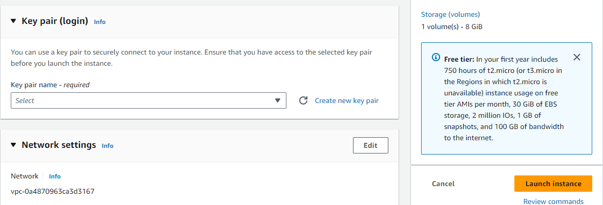

**Step 2**: Open port 8000. We will run our webservers on port 8000 while the load balancer will run on port 80. We need to allow port 8000 to run anywhere by adding a rule to to the security group of each of our webservers.

Click on the instance ID to get the details of your EC2 instance.

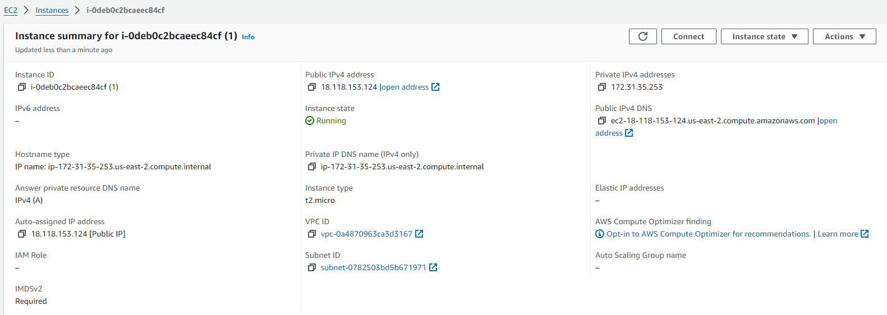

* On that same page, scroll down and click security.

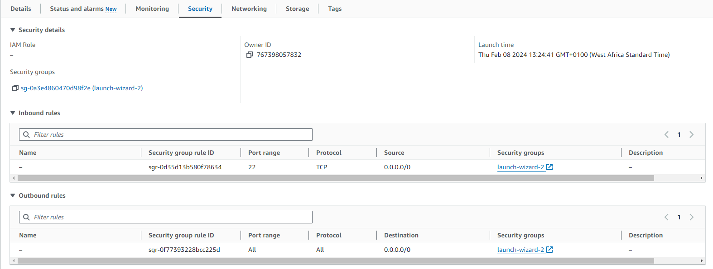

* Click on Security Group and the Edit Inbound Rules

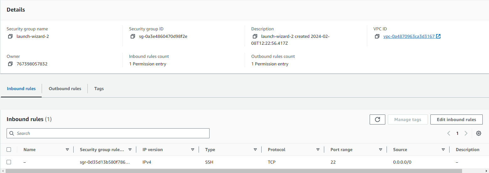

* Click on Add Rule, select Custom TCP and input port 8000, then select Anywhere-IPV4. Click on save Rules.


**Step 3** : Install Apache Webserver

Fisrt, connect to each of the webservers via SSH and then run commands on the terminal of the webservers.

* Click on connect.

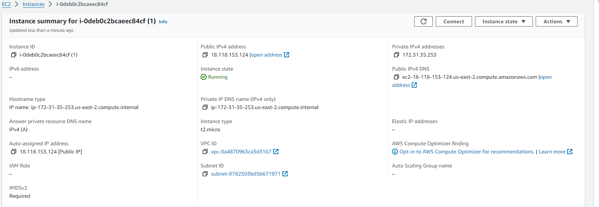

* Go to the SSH client tab and copy the SSH command.

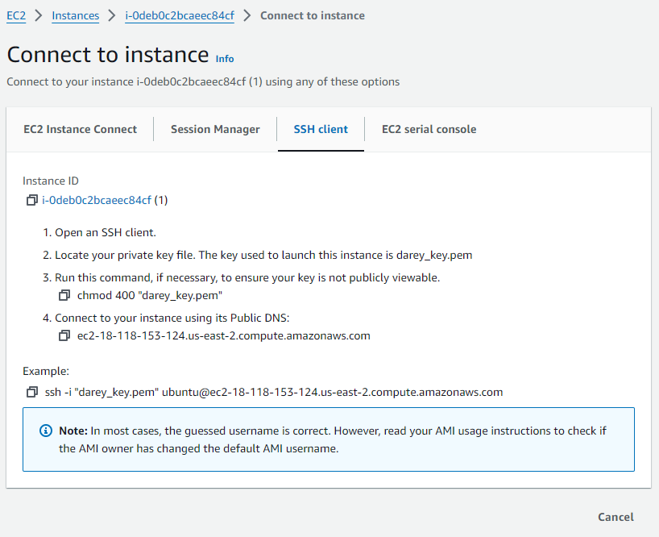

* Open a terminal in your local machine and cd into the folder your key pair is. Paste the SSH command you copied in the previous step.

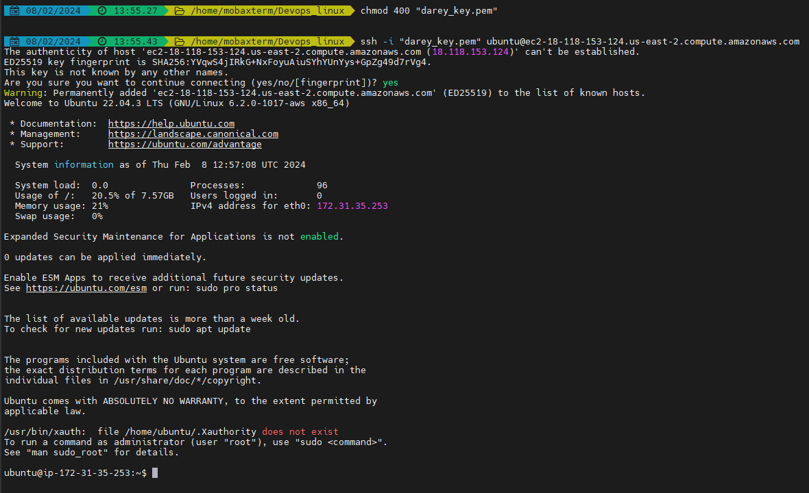


* Next, update the server and install Apache with the below command :

```sudo apt update -y && sudo apt install apache2 -y```


* Verify that the apache is running using the command below:

```sudo systemctl status apache2```

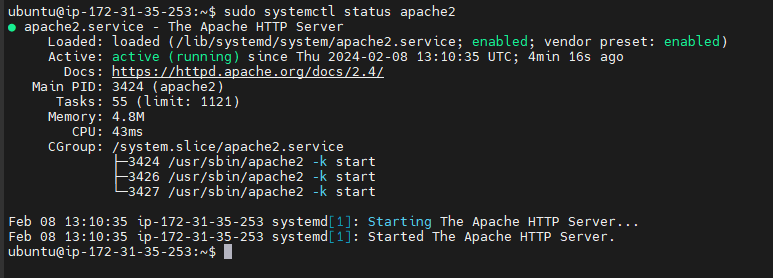

**Step 4** : Configure Apache to serve a page showing its public IP.

We will configure the Apache webserver to serve its content on port 8000 instead of the default port 80. We then create a new index.html file which will contain code to display the public IP of the EC2 instance. We will override Apache webserver's default html file with our new file.

* Configuring Apache to serve content on port 8000.

1. Using your text editor (e.g vi or nano), open the file /etc/apache2/ports.conf

```sudo vi /etc/apache2/ports.conf```

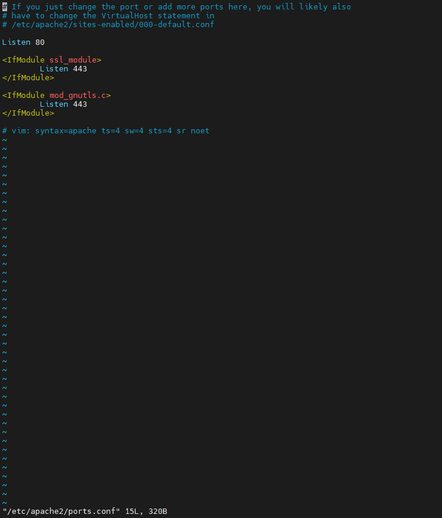

2. Add a new listen directive for port 8000. First type i to switch the editor to the insert mode, then add the listen directive and save the file.

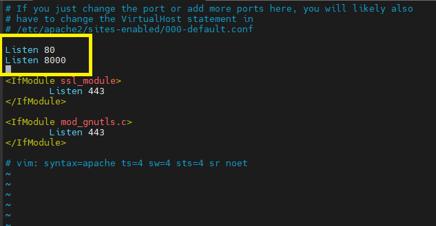

3. Next, open the file /etc/apache2/sites-available/000-default.conf and change port 80 on the virtual host to 8000 as in the below snapshot.

```sudo vi /etc/apache2/sites-available/000-default.conf```


4. Close the the file by pressing the ```esc``` key on your keyboard followed by wq! and then press ```enter```.

5. Restart Apache to load the new configuration using the command below :

```sudo systemctl restart apache2```


* Creating our new html file.

1. Open a new index.html file with the below command.

```sudo vi index.html```

2. Swith the vi editor to insert mode and paste the html file below. Replace the IP address placeholder text in the html file with the public address of your EC2 instance.

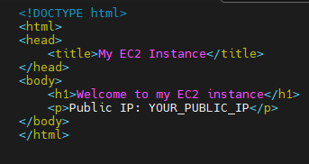


3. Change the ownership ofthe index.html file withthe command below:

```sudo chown www-data:www-data ./index.html```


* Overridding the default html file of the Apache webserver.

1. Replace the default index.html file with the new index.html file using command below :

```sudo cp -f ./index.html /var/www/html/index.html```


2. Restart the Apache webserver to load the new configuration using the command below :

```sudo systemctl restart apache2```

3. You should have a page similar to the below displayed on your browser.


**Step 5**: Configuring Nginx as load balancer

* Provision a new EC2 instance running Ubuntu 22.02 and ensure that port 80 that can accept traffic from anywhere is open. You can follow Step 1 and Step 2 above on how to do this.

* Follow Step 3 above and SSH into the instance.

* Next, install Nginx using the terminal with the below commwand :

```sudo apt update -y && sudo apt install nginx -y```

* Verify that Nginx is installed by running the below command :

```sudo systemctl status nginx```


* Open Nginx configuration file with the command below :

```sudo vi /etc/nginx/conf.d/loadbalancer.conf```

* Paste the configuration file below to configure nginx to act as a load balancer. A sample screenshot as captured below.


* Edit the file and provide all neccessasy information such as the IP address


Upstream backend servers define a group of backend servers. The server lines inside the upstream block list the addresses and ports of your backend servers. proxy_pass inside the location block sets up the load balancing, passing the requests to the backend servers. The proxy_set_header lines pass necessary headers to the backend servers to correctly handle the requests.

* Test your configuration using the below command :

```sudo nginx -t```


* Restart nginx to load the new configuration using the command below :

```sudo systemctl restart nginx```

* Paste the public address of the Nginx load balancer and you should see the same web pages served by the webservers.


## Load Balancing Algorithms

The load balancing algorithm that is used determines which of the healthy servers on the backend will be selected. A load balancing algorithm is the set of rules that a load balancer follows to determine the best server for each of the different client requests. Load balancing algorithms fall into two main categories.

### Static load balancing

Static load balancing algorithms follow fixed rules and are independent of the current server state. The following are examples of static load balancing.

1. **Round Robin** — Round Robin means servers will be selected sequentially. The load balancer will select the first server on its list for the first request, then move down the list in order, starting over at the top when it reaches the end.

2. **Weighted round-robin method** - In weighted round-robin load balancing, you can assign different weights to each server based on their priority or capacity. Servers with higher weights will receive more incoming application traffic from the name server.

3. **IP hash method** - In the IP hash method, the load balancer performs a mathematical computation, called hashing, on the client IP address. It converts the client IP address to a number, which is then mapped to individual servers.

### Dynamic load balancing

Dynamic load balancing algorithms examine the current state of the servers before distributing traffic. The following are some examples of dynamic load balancing algorithms.

1. **Least Connections** — Least Connections means the load balancer will select the server with the least connections and is recommended when traffic results in longer sessions.

2. **Weighted least connection method** - Weighted least connection algorithms assume that some servers can handle more active connections than others. Therefore, you can assign different weights or capacities to each server, and the load balancer sends the new client requests to the server with the least connections by capacity.

3. **Least response time method** - The response time is the total time that the server takes to process the incoming requests and send a response. The least response time method combines the server response time and the active connections to determine the best server. Load balancers use this algorithm to ensure faster service for all users.

4. **Resource-based method** - In the resource-based method, load balancers distribute traffic by analyzing the current server load. Specialized software called an agent runs on each server and calculates usage of server resources, such as its computing capacity and memory. Then, the load balancer checks the agent for sufficient free resources before distributing traffic to that server.

### SSL Termination and HTTPS Load Balancing
#### SSL

Secure Sockets Layer, SSL, is a protocol for establishing encrypted and authenticated links between networked computers in order to keep internet connections secure and to safeguard sensitive data.

#### SSL Termination

SSL identifies information about the website, such as the domain name and, optionally, information about the site’s owner. SSL may be establishing links between server-to-server or server-to-client.

#### Types of encryption

The two most common types of encryption algorithms are symmetric and asymmetric.

Symmetric encryption, also known as a shared key or private key algorithm, uses the same key for encryption and decryption. Symmetric key ciphers are considered less expensive to produce and do not take as much computing power to encrypt and decrypt, meaning there is less of delay in decoding the data.

The drawback is that if an unauthorized person gets their hands on the key, they will be able to decrypt any messages and data sent between the parties. As such, the transfer of the shared key needs to be encrypted with a different cryptographic key, leading to a cycle of dependency.

Asymmetric encryption, also known as public-key cryptography, uses two separate keys to encrypt and decrypt data. One is a public key shared among all parties for encryption. Anyone with the public key can then send an encrypted message, but only the holders of the second, private key can decrypt the message.

Asymmetric encryption is considered more expensive to produce and takes more computing power to decrypt as the public encryption key is often large, between 1,024 and 2,048 bits. As such, asymmetric encryption is often not suited for large packets of data.

#### The purpose of TLS/SSL Certificate

Transport Layer Security (TLS) certificates—most commonly known as SSL, or digital certificates—are the foundation of a safe and secure internet. TLS/SSL certificates secure internet connections by encrypting data sent between your browser, the website you’re visiting, and the website server. They ensure that data is transmitted privately and without modifications, loss or theft.

TLS/SSL certificates are the standard by all major web browsers to ensure a safer internet experience for users. Websites secured by TLS/SSL certificates are more trusted by internet users because they encrypt and protect private information transferred to and from their website. They also represent, or certify, your website’s brand identity. In that sense, TLS/SSL certificates are both an identity protection measure for online brands, and a security measure for companies transmitting private data online.

#### How TLS/SSL Works

These are the essential principles to grasp for understanding how SSL/TLS works:

```
Secure communication begins with a TLS handshake, in which the two communicating parties open a secure connection and exchange the public key
During the TLS handshake, the two parties generate session keys, and the session keys encrypt and decrypt all communications after the TLS handshake
Different session keys are used to encrypt communications in each new session
TLS ensures that the party on the server side, or the website the user is interacting with, is actually who they claim to be
TLS also ensures that data has not been altered, since a message authentication code (MAC) is included with transmissions
```

With TLS, both HTTP data that users send to a website (by clicking, filling out forms, etc.) and the HTTP data that websites send to users is encrypted. Encrypted data has to be decrypted by the recipient using a key.

#### Advanced Load Balancing Features

Advanced features of load balancing enhance the capabilities and efficiency of load balancers ib handling complex scenerios and optimizing application performance. Here are some key advanced features.

1. **SSL offloading/Termination** : When information is transmitted through SSL secure protocol, web server takes action to encrypt and/or decrypt your web traffic. This process assigns a substantial load on the web server which will affect the performance of web server.

To deal with the added burden of encrypting data on the server, many networks now employ SSL offloading. This network solution involves the removal of SSL encryption from incoming traffic before it reaches the web server. SSL offloading is taking care of SSL process on a separate device so that it doesn’t affect the web server’s performance.

2. **Session persistence/sticky sessions** : Session Persistence (sometimes called sticky sessions) involves directing a user’s requests to one application or backend web server for the duration of a “session.” The session is the time it takes a user to complete a transaction or task that might include multiple requests.

3. **Health checks/Automatic Server Failover** : Failover is usually associated with a health check system where the load balancer listens for irregular health checks between itself and the backend servers. If there are irregular health checks or a health check is not returned, then the load balancer removes the unhealthy server from the server pool and re=rotes traffic to heathy servers thus ensuring high availability. Failover is automatic and operates without warning to reduce downtime.

4. **Global server load balancing or GSLB** : Global server load balancing or GSLB is the practice of distributing Internet traffic amongst a large number of connected servers dispersed around the world. The benefits of GSLB include increased reliability and reductions in latency.

5. **Application-Layer Load Balancing** : Application load balancer operates at the highest level applicable and provides for deeper context on the Application Layer protocols such as HTTP. Operating at the Application Layer, a Layer 7 Load Balancer can use this additional application awareness to make more complex and informed load balancing decisions based on the content of the message, to apply optimizations and changes to the content (such as HTTP header manipulation, compression and encryption) and ensure reliability and availability by monitoring the health of applications.

6. **Dynamic Load Balancing** : It is a more versatile scheme of load balancing which can dynamically identify the amount of load that needs to be shed during runtime and which system should bear the load.

7. **Anycast Load Balancing** : Anycast is a network routing technique where many hosts have the exact same IP address. Clients trying to reach that IP address are routed to the nearest host. If these duplicate hosts all provide the same service, the clients simply receive the service from the host topologically nearest. Routing to multiple servers will effectively balance load among the servers, improving site speed.

8. **Rate Limiting and Traffic Shaping** : Traffic shaping allows you to control the bandwidth of data flowing into and out of your load balancers. As “traffic shaping” suggests, it provides you the ability to shape traffic, limiting the amount of bandwidth available to certain streams, to ensure that bandwidth is not overused and does not become congested

9. **Web Application Firewall** : A WAF or web application firewall helps protect web applications by filtering and monitoring HTTP traffic between a web application and the Internet. It typically protects web applications from attacks such as cross-site forgery, cross-site-scripting (XSS), file inclusion, and SQL injection, among others.

These advanced features make load balances powerful tools for optimizing application performance, ensuring high availability and protecting applications from various threats and failures