# Automating Load Balancer Configuration with Shell Scripting

The process of manually setting up load balancers as described in the previous project might not be as tasking if we are only dealing with 2 or 3 servers. However, working on multiple servers could involve complex and repetitive tasks which will make manual process of configuration to not only be susceptible to errors but will also greatly reduce efficiency.

To overcome this, we can streamline our load balancer configuration with ease using shell scripting and simple CICD on Jenkins. In this project, we will automate the set up and maintenance of our load balancer with shell scripting and jenkins.

## Automate the Deployment of Webservers

In order to increase the speed of deployment, the entire process in the previous project will be automated. Instead of typing commands in our terminal to deploy 2 backend Apache servers with an Ngnix load balancer distributing traffic across the webservers, we will write a shell script that will automate the entire process.

## Deploying and Configuring the Webservers

The process to deploy our webservers have been codified in the shell script below :


## Steps to Run the Shell Script

**Step 1** : Launch an instance on AWS EC2. Select ubuntu 20.04, create your key pair and launch.


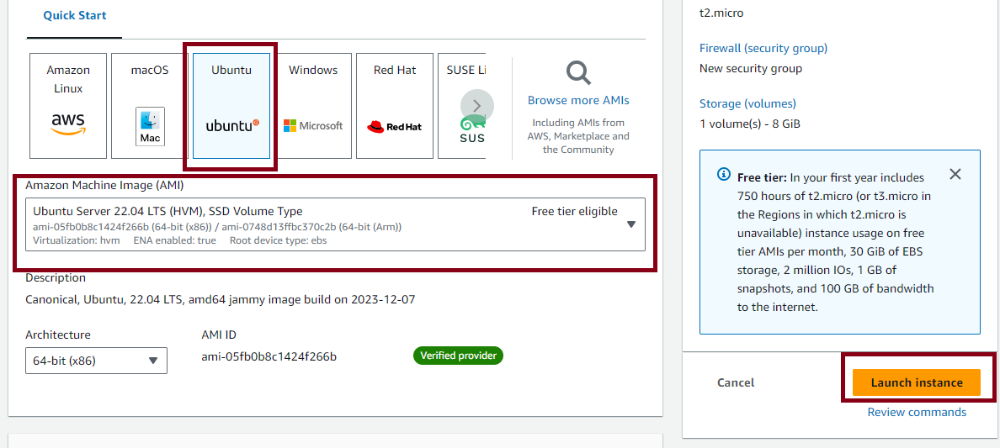

**Step 2** : Go to the security group and open port 8000 from anywhere to allow traffic.

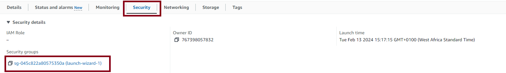


**Step 3** : Connect to the server via the SSH client

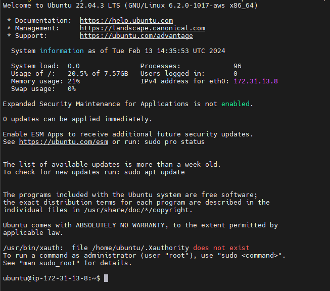

**Step 4** : Open a file and paste the command above. Run the command above ensuring to replace the placeholder IP address:

```sudo vi file.sh```

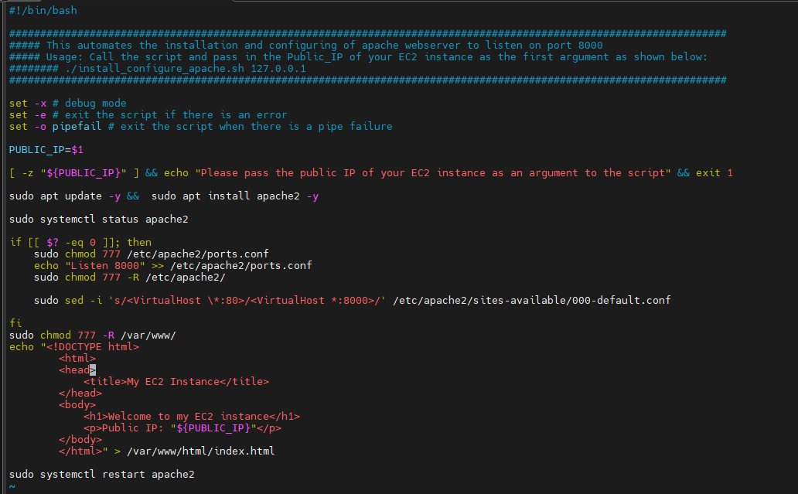

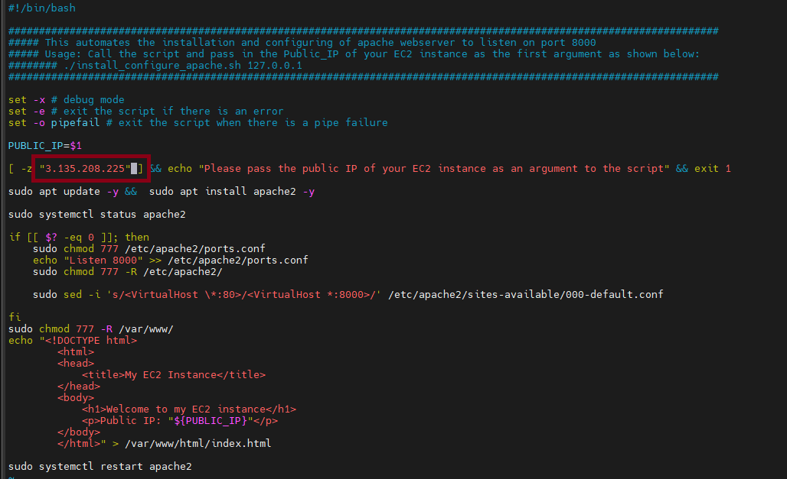

To close the file press ```esc``` and the press ```shift + :wq!```

**Step 5** : Change the permission on the file to make it executable using the command below :

```sudo chmod +x file.sh```

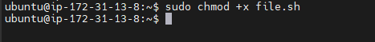


**Step 6** : Run the shell script using the command below :

```./file.sh```


# Deployment of Nginx as a Load Balancer using Shell Script

Since we have successfully deployed and configured the two webservers, we shall now proceed to also install and configure the load balancer.

As with the webservers, we need to launch an EC2 instance on AWS running on ubuntu 22.04. We the open port 80 anywhere using the security group and connect to load balancer via the terminal.

## Deploying and Configuring Mginx Load Balancer

The process to deploy and configure our load balancer is codified in the below shell script.


## Steps to Run the Shell Script

**Step 1** : Launch an instance on AWS EC2. Select ubuntu 20.04, create your key pair and launch.


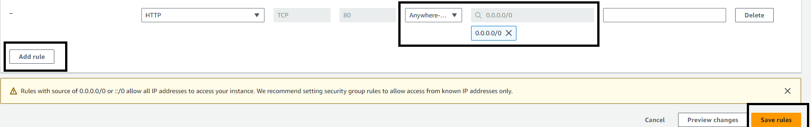

**Step 3** : Connect to the server via the SSH client

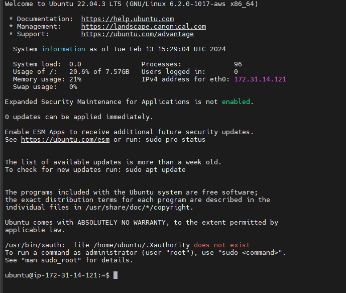

**Step 4** : Open a file and paste the command above. Run the command above ensuring to replace the placeholder IP addresses:

```sudo vi nginx-script.sh```


To close the file press ```esc``` and the press ```shift + :wq!```

Step 5 : Change the permission on the file to make it executable using the command below :

```sudo chmod +x nginx-script.sh```


```./nginx-script.sh 18.116.81.33 18.119.114.35:8000 3.135.208.225:8000```


## Verifying the Setup

### Screenshot for Webserver one

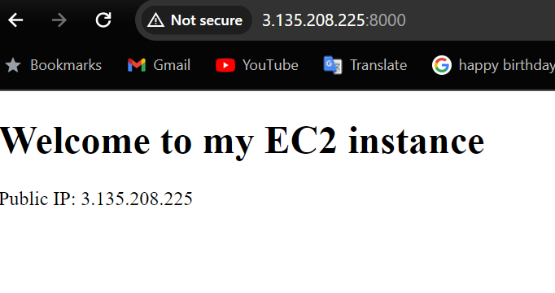

### Screenshot for Webserver two

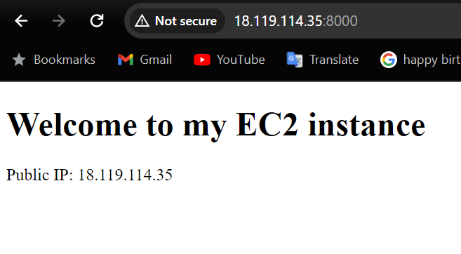

### Screenshot for the loadbalancer

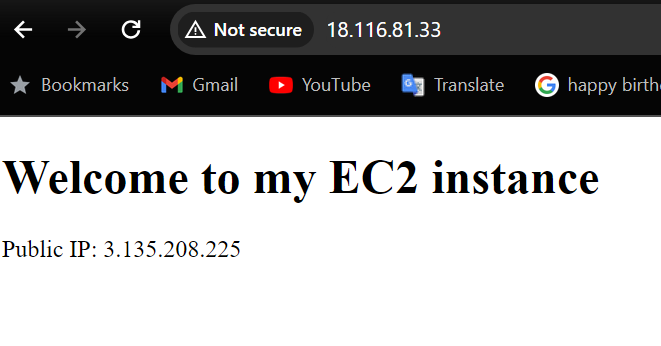

# Done!!!